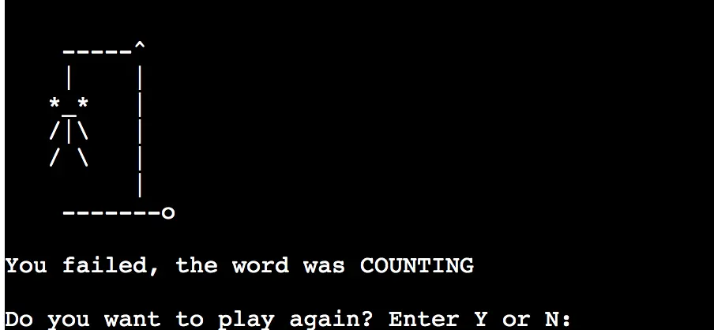

# Hangman
insert images here

## Overview 

Hangman is a classic game where the player attempts to determine the hidden word. Players are presented with blank spaces and have to individually guess letters until the blank spaces are exchanged for letters. Each wrong letter guess results in the construction of a man hanging until the final image is drawn and the game is over. In this version, a word is randomly generated by the computer and the user has 7 chances to enter a unqiue letter and guess the word. Each time the user inputs an incorrect answer, a visual hangman graphic is displayed to the user to indicate the incorrect letter. 
Once the game is won, the user has the choice to play again or return to the main menu.

## Aims

The aim of this site is provide a fun, interactive and easy accessable game that provides a challenge to the user. Users should be able to recieve real time feedback as to wether their guess is correct or incorrect. Users should know whether they've won or lost the game. Users should have the ability to easily replay the game once completed.

## Planning stage
During the planning stage, I initally thought about the logic that the game must follow in order to run. I considered the step by step process from a user point of view and how their interaction with the game could be affect the steps and logic within the game.
I considered:
* How the game would initally load
* What would be the first interaction/input from the user
* How would the user input affect the logical steps of the game

Once i considered these processes I created a flowchart to suppliment the process of building. 

** INSERT IMAGE **

## Features

### Home Page

The home page of the site features a hangman logo.

The user is greated by a welcome message.

Within the welcome message, there is a concise description of the rules of the game.
The user is then invited to input their first name. The user can only enter alphabetic characters or the game will not regonise the users input. 

Once the user input their name, the game recognises the user and a short message is displayed to the user. The game then automatically starts. 

### Main game

Once the game has loaded, a hangman image appears

Once the game begins, a random word is generated from a list of words using the python random module. 
The length of the words are then repensented by underlines to show how many letters are in the word. 

Displayed to the user, is the amount of lives the user has, which decreases every incorrect letter used, the letters the user has already used and the input for the user to guess a letter. 

The user cannot guess the same letter more than once. A message is displayed to user if they try and use the same letter more than once and their guess is discounted. 

 

The user can only guess one letter at a time and cannot use any numbers or special characters. A message will displayed to the user if they try. 

### Gameover

If the user wins the game, a winners message is displayed to the user with the correct word in full. 

If the user loses the game, the completed hangman image is displayed with the correct word in full 

Whether the user wins or loses the game they are presented with the option to play again or not. If they chose not to they will return to the home page. 

Players can only enter Y or N otherwise an error message will be displayed and they'll be asked to enter a vaild input. 

### Clear Terminal

A clear feature was implemented in order to keep the page clear and orderly for the user. 

## Future Features

Features that could be implemented for the future:
* Game modes of easy medium and hard - the vocabulary difficulty of the word depends on the game mode
* An 'Extreme' mode where there is a timer and users have a time limit to guess each question. 

## Testing

The hangman python code was tested using the PEP8 validator 

each .py file was tested 

### run.py validation

### hangmanimg.py validation

### words.py validation 

All .py files passed thought validation without any bugs. 

## Manual testing 

| Feature | Test | Outcome |
|---------|------|---------|
|Hangman logo | Displayed in terminal and heroku | Pass 
|Game instructions | Clearly displayed | Pass
|Input for user name | Sser can only enter alphabetic letters | Pass
|Welcome message | Feedback message with users name displayed / messaged timed before game loads | Pass
|Hangman graphic | Displayed and updated depending on correct or incorrect guess | Pass
|User lives displayed | Lives updated when user inputs wrong guess | Pass
|Letters used displayed | Updates and displays the letters the user has already input | Pass
|Missing letters updated | correct letters guessed updated the '_' displayed | Pass
|Guess letter input | User can only enter one alaphabetic at a time or error message displayed | Pass
|Terminal clear | Terminal clears for cleaner user display | Pass
|Game win or fail | Win or lose message displayed depending on whether user wins or loses | Pass
|Replay | User has ability to replay or go to main menu | Pass
|Replay input | User can only enter Y or N or error message displayed | Pass 

## Bugs

When initially creating the logic to restrict the user from inputting the same letter twice, the while loop created a bug which infinitely printed a message.

This bug was solved by rethinking the logic of the while loop. 

A bug which occurred with the user inputting their name was that the user could enter a number or special character as their user name. This was solved by creating a while loop that only allows users to enter letters. 

When put initially put through the PEP8 validator a no new newline at end of file error was displayed
 

This was fixed by adding a newline at the end of the run.py file. 

## Deployment 